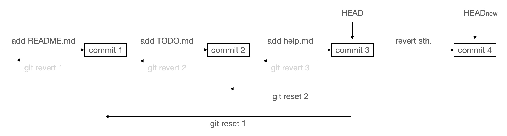

# Git笔记

> 参考文章：
>
> [杨希杰|Git]([Git - 杨希杰的个人网站](https://yang-xijie.github.io/LECTURE/Git/git/)) 
>
> [廖雪峰|Git教程]([Git是什么 - Git教程 - 廖雪峰的官方网站](https://liaoxuefeng.com/books/git/what-is-git/index.html))

## 为什么要用Git

* 版本控制

比如，你晚上写一篇论文，写好了存起来。结果第二天早上起来，你再拿出来一看，害，写的什么啊。早上修改了一大堆，改完了存起来。结果下午一想，害，早上我改什么啊！昨晚那个写的不是挺好的吗…但这时，你已经没有昨晚存的那一份文稿了，只能凭着记忆把论文再改回昨晚写完之后的样子……

这时，你想：如果有一个工具，把我每次修改的内容都记录下来，那么我每次想反悔的时候，这个工具能帮我把文稿恢复到原来的样子就好了！

* 合作开发

比如，你写一篇论文，写好了存起来，同时发给了你的实验室同伴和导师。你的同伴看到你有几个单词写错了，帮你改了又发回来；你的导师觉得你有段内容写的逻辑不太清，帮你简单改写了一下又发了回来。在等待两人回复的时间，你又发现论文的参考文献少添加了几个，花了点时间把它们加上。过了一会，你收到了同伴和导师改的两份文件，然后你打开你改好的论文，把你同伴改正的单词挑出来放进去，把你的导师改的那一段复制粘贴过去…

这时，你想：要是有个工具，能帮我把大家所做的更改方便的合并在一起就好了！

**Git**就是这样的一个工具，只不过，我们一般不同它来管理论文，我们会用`Git`来管理项目。什么是项目，软件开发的一堆代码文件合在一起算一个项目，一本大家一起来写教程书算是一个项目……我们用`Git`来对这些项目进行管理、结合代码托管平台（比如`GitHub`），大家一起合作开发，修改代码或文章。

## 正文

### 安装配置Git

最早Git是在Linux上开发的，很长一段时间内，Git也只能在Linux和Unix系统上跑。不过，慢慢地有人把它移植到了Windows上。现在，Git可以在Linux、Unix、Mac和Windows这几大平台上正常运行了。

要使用Git，第一步当然是安装Git了。根据你当前使用的平台来阅读下面的文字：

### 在Linux上安装Git

首先，你可以试着输入`git`，看看系统有没有安装Git：

``````
$ git
The program 'git' is currently not installed. You can install it by typing:
sudo apt-get install git
``````

像上面的命令，有很多Linux会友好地告诉你Git没有安装，还会告诉你如何安装Git。

如果你碰巧用Debian或Ubuntu Linux，通过一条`sudo apt-get install git`就可以直接完成Git的安装，非常简单。

### 在Windows上安装Git

在Windows上使用Git，可以从Git官网直接[下载安装程序](https://git-scm.com/downloads)，然后按默认选项安装即可。

安装完成后，在开始菜单里找到“Git”->“Git Bash”，蹦出一个类似命令行窗口的东西，就说明Git安装成功！

安装完成后，还需要最后一步设置，在命令行输入：

```plain
$ git config --global user.name "Your Name"
$ git config --global user.email "email@example.com"
```

因为Git是分布式版本控制系统，所以，每个机器都必须自报家门：你的名字和Email地址。

注意`git config`命令的`--global`参数，用了这个参数，表示你这台机器上所有的Git仓库都会使用这个配置，当然也可以对某个仓库指定不同的用户名和Email地址。

## Git基础

### 创建版本库

什么是版本库呢？版本库又名仓库（Repository），你可以简单理解成一个目录，这个目录里面的所有文件都可以被Git管理起来，每个文件的修改、删除，Git都能跟踪，以便任何时刻都可以追踪历史，或者在将来某个时刻可以“还原”。

所以，创建一个版本库非常简单，首先，选择一个合适的地方，创建一个空目录：

```plain
$ mkdir learngit
$ cd learngit
$ pwd
/Users/michael/learngit
```

> [!WARNING]
> 如果你使用Windows系统，为了避免遇到各种莫名其妙的问题，请确保目录名（包括父目录）不包含中文。

第二步，通过`git init`命令把这个目录变成Git可以管理的仓库：

```plain
$ git init
Initialized empty Git repository in /Users/michael/learngit/.git/
```

瞬间Git就把仓库建好了，而且告诉你是一个空的仓库（empty Git repository），细心的读者可以发现当前目录下多了一个`.git`的目录，这个目录是Git来跟踪管理版本库的，没事千万不要手动修改这个目录里面的文件，不然改乱了，就把Git仓库给破坏了。

如果你没有看到`.git`目录，那是因为这个目录默认是隐藏的，用`ls -ah`命令就可以看见。

### 工作区、暂存区、本地版本库

#### 概述

#### GIT INIT

在你执行`git init`的文件夹（存在`.git/`文件夹）中：

工作区（Working Directory）：你在电脑里可以看到的所有文件。这些文件你可以任意修改，或者说，你修改的总是工作区的文件。

暂存区（Stage）：通过`git add`命令将文件添加到暂存区。可以多次使用`git add`命令来记录添加或修改的文件内容。

本地仓库（Repository）：通过`git commit`命令将暂存区的所有添加/修改放入本地仓库/本地版本库。一般来说，当一些比较大的修改完成，我们会使用`git commit`命令完整记录这次修改，每次commit被称作一个版本，因此将存储这些commit的仓库叫做版本库。以后可以通过`git log`命令快速查看这些commits或进行版本回退。

也就是说，你每次使用`git commit`，Git就会帮助你记录这次做的更改，这样你以后想后悔的时候通过commit回退就可以了。就好像打闯关游戏的时候会存档，每次存档之后，如果你打Boss挂了，没事儿，从存档点重来就可以了。

#### GIT ADD

```bash
git add <file>
```

可以添加文件，也可以添加文件夹。也可以按照通配符来添加。

#### GIT COMMIT

commit最重要的作用是，之后你可以通过某次commit版本号查看或者回到这次commit。一般来说，当你觉得改了一些东西的时候，都可以commit一下。也有不少人觉得应该每改一个文件add一次commit一次。都可以，这个看个人习惯。但是注意不要改了好多才commit，因为这样更改的记录就不是那么清晰了。

``````bash
git commit -m "<message>"
## 或
git commit -m"<message>"
``````

一般`<message>`使用动词加名词的形式，记录你这次`commit`修改的主要内容。使用英文或中文都可以，个人推荐使用英文，因为如果你之后开源，英文可以让你方便的将你的项目推向世界。

#### GIT STATIS

查看每个区的状态。

#### GIT DIFF

``````bash
git diff # worktree & stage (Changes in the working tree not yet staged for the next commit.)
git diff HEAD # worktree & HEAD (Changes in the working tree since your last commit.)
git diff --cached # stage & HEAD (Changes between the index and your last commit.)
git diff <commit> <commit> # between two commits
``````

更好的是，直接在`VS Code`或`Xcode`中查看（左侧的颜色条），这样更方便。或者采用一些插件查看，比如`VS Code`的插件`git graph`

这里可以看到Git判断文件修改是按照行来判断的。你改了一个单词，Git只会记录：这一行被更改，原来为xx，改为了xx；你添加了一段代码，Git只会记录：添加了xx行，内容为xx。

所以： * Git一般只能管理文本文件，而且是按照行管理的 * 二进制文件也可以通过`git add`让Git来管理，但二进制文件被更改的话，Git只知道文件更改了，无法记录是怎么更改的；而且如果一直使用Git管理二进制文件，`.git/`文件夹会越来越大，这不利于网络传输。 * 像`Microsoft Word`的`.docx`文件就是二进制文件，一般不会用Git来管理。（除了Git还有很多别的版本管理工具/软件哦，大家感兴趣可以自行了解）

#### GIT LOG

（多次commit之后查看）

``````bash
git log
``````

log——日志

看到了最开始设置的邮箱和名字，也就是说，谁提交的commit，在log里面是都能看得到的哦。

看到了每次commit都有一串编号，这个编号是根据每次一次commit的文件计算出来的，我们将其称为版本号。之后如果要查看某一次commit，可以通过这些版本号查看（但比较长，写前几位就可以了）

也看到了每次commit附加的message，这样就能知道每次commit都做了什么。

#### GIT RM

在Git中，删除也是一个修改操作，我们实战一下，先添加一个新文件`test.txt`到Git并且提交：

```bash
$ git add test.txt

$ git commit -m "add test.txt"
[master b84166e] add test.txt
 1 file changed, 1 insertion(+)
 create mode 100644 test.txt
```

一般情况下，你通常直接在文件管理器中把没用的文件删了，或者用`rm`命令删了：

```bash
$ rm test.txt
```

这个时候，Git知道你删除了文件，因此，工作区和版本库就不一致了，`git status`命令会立刻告诉你哪些文件被删除了：

```bash
$ git status
On branch master
Changes not staged for commit:
  (use "git add/rm <file>..." to update what will be committed)
  (use "git checkout -- <file>..." to discard changes in working directory)

	deleted:    test.txt

no changes added to commit (use "git add" and/or "git commit -a")
```

现在你有两个选择，一是确实要从版本库中删除该文件，那就用命令`git rm`删掉，并且`git commit`：

```bash
$ git rm test.txt
rm 'test.txt'

$ git commit -m "remove test.txt"
[master d46f35e] remove test.txt
 1 file changed, 1 deletion(-)
 delete mode 100644 test.txt
```

!!! note

    先手动删除文件，然后使用`git rm <file>`和`git add<file>`效果是一样的。
​    另一种情况是删错了，因为版本库里还有呢，所以可以很轻松地把误删的文件恢复到最新版本：

```plain
$ git checkout -- test.txt
```

`git checkout`其实是用版本库里的版本替换工作区的版本，无论工作区是修改还是删除，都可以“一键还原”。

!!! warning
    从来没有被添加到版本库就被删除的文件，是无法恢复的！

#### 舍弃工作区/暂存区的修改

舍弃更改`==`用某些之前的东西来覆盖

``````bash
git --help restore # 查看restore命令的帮助文档
``````

`git restore` == `git restore --worktree` 默认是覆盖worktree

``````bash
-s <tree>, --source=<tree>
Restore the working tree files with the content from the given tree. If not specified, the default restore source for the working tree is the index, and the default restore source for the index is HEAD.

-W, --worktree, -S, --staged
Specify the restore location. If neither option is specified, by default the working tree is restored.
``````


#### 版本回退

首先我们需要明确两点：每一次`commit`的编号，一方面代表所有文件的状态，另一方面代表这一次`commit`相比于上一次`commit`所做的更改。

那么我们如果希望回到之前的某个`commit`，指的就是直接将工作区所有文件都恢复成那个`commit`之后的样子。

这时我们需要使用：

``````bash
git reset --hard <commit>
``````

如果我们希望撤销某次`commit`所做出的更改，那么我们需要使用：

``````bash
git revert <commit> # Git帮你提交
git revert -n <commit> # -n: --no-commit，自己提交
``````


两种回退的分析：

`git reset --hard`是非常方便的回退方式。如果你写代码提交了两个`commit`之后去吃饭，吃完回来一看，觉得刚刚状态不太好写的不行，于是你`git reset --hard`回到两个版本之前，发现所有的东西都变成了你修改代码前的样子。

`git reset --hard`会删除`commit`，所以如果你在某次`commit`中添加了敏感信息（如账号密码等），那么使用`git reset --hard`进行恢复是十分明智的选择。

但是要注意，在上面的案例中，如果你已经将两次`commit`使用`git push`上传到了Git服务器，那么`git reset --hard`一定会给团队协作带来混乱（因为你直接删除了两个commit！）。这时怎么办呢？你可以使用两次`git revert -n`再`git commit`，这样你会新生成一个`commit`，这个`commit`的内容和往前两次`commit`的内容一样，由于这是新生成的`commit`，所以push到服务器也完全没有问题。

那么如果把密码`git push`到服务器了呢？这时`Git`已经帮不了你了。要不直接在代码托管平台直接删掉项目吧（不推荐），要不就赶紧去改密码吧…

注：其中的版本号`<commit>`可以通过`git log`查看。

注：向后回退一个版本可以写为`git reset --hard HEAD^`，`HEAD^^`表示当前版本向后2个`commit`，`HEAD~n`表示当前版本向后n个`commit`。

### Git进阶 - gitignore

我们因为之后要进行合作开发，或者你想把你的Git仓库分享至网络，我们都需要上传`.git/`文件夹。这样的话，我们就不希望这个文件夹太大，不然别人下载起来很慢；我们也不希望一些私密的文件上传上去，比如含有某些密码的文件；以及一些乱七八糟的文件，我们也不想让别人看到。因此，在`git add`和`git commit`的时候，我们就要注意不要把一些很大的图片、视频、第三方包等大文件，还有一些密码、个人配置文件添加进Git仓库。

我们可以在每次`git add`的时候都注意不去添加这些文件，但是刚刚说到，最常用的添加文件的方式是`git add .`，那么如何告诉Git我们不希望添加的那些文件，让Git自动帮我们排除添加这些文件呢？

通过在项目的文件夹中创建一个`.gitignore`文件，在其中写出你不希望Git追踪的文件和文件夹，之后在使用`git add`命令时，Git就不会添加这些文件和文件夹进暂存区。

我们在开始某种项目的时候，会先在[GitHub的`.gitignore`模板](https://github.com/github/gitignore)找一份`.gitignore`，再在其中添加自己不需要Git追踪的文件。比如要开始Swift项目的开发，我们会先下载Swift的`.gitignore`模板<https://github.com/github/gitignore/blob/master/Swift.gitignore>，再在其中添加比如一些自己用来测试的文件夹、存放密码的文件等。

使用`*`可以代替文件的一部分名称。比如使用`*.log`让Git不要添加所有的日志文件。

给`.gitignore`添加注释，使用`#`即可。

通过在最前面添加`!`可以讲已经忽略的文件再添加回来。比如前面写了`*.txt`忽略了所有你希望Git忽略的`txt`文件，但是里面有一份`IMPORTANT.txt`你希望添加，那么可以在`.gitignore`后面添加`!IMPORTANT.txt`。还有一点要注意，如果你之前忽略了一整个文件夹，那么之后是不能再用`!`添加这个文件夹里面的文件的。可以参考一下下面的文档：

[Git Docs | gitignore](https://git-scm.com/docs/gitignore)

> An optional prefix "!" which negates the pattern; any matching file excluded by a previous pattern will become included again.
> It is not possible to re-include a file if a parent directory of that file is excluded. Git doesn’t list excluded directories for performance reasons, so any patterns on contained files have no effect, no matter where they are defined.

在开始写项目代码之前就创建好`.gitignore`并添加到Git中是一个好的习惯。

### Git进阶 - 分支

#### 分支

创建一个分支，你可以在这个分支上开发新功能A，过一段时间，你又想开发新功能B，这时你可以再开一个分支。过了一段时间，你两个新功能都开发好了，就可以将两个分支合在一起，这样你的产品就同时有了两个新的功能。

#### 分支操作

```sh
git branch --create(-c) <branch> # 创建分支
git branch # 查看本地分支
git switch <branch> # 切换分支
```

```sh
## 开发好了新功能之后
git switch main # 切换到主分支，因为我们的所有功能都要合并到一个分支上
git merge <branch> # 将开发新功能的分支的内容合并（merge）到main分支上
git branch --delete(-d) <branch> # 删除开发新功能的分支，因为开发好了合并进来原来的开发分支就没有用了
```

#### 解决冲突

合并的时候可能会产生冲突。这时我们需要自己去解决冲突。比如你和同学一块写UI组件，各自开了一份文件来写，结果你俩把文件名起成了一样的，或者在同一份文件中修改了相同的地方，这时在第一个同学合并之后，第二个同学的合并就会出现冲突。解决冲突的方式很简单，在被Git用箭头标出来的地方进行删改就好了。

#### 分支案例

#### 注：设置默认分支为main
[Stack Overflow | How can I create a Git repository with the default branch name other than master?](https://stackoverflow.com/questions/42871542/how-can-i-create-a-git-repository-with-the-default-branch-name-other-than-maste)

```sh
## 查看Git版本
git --version
## Since git version 2.28.0
git config --global init.defaultBranch main
## 之后使用git init初始化项目的默认分支会变为main
git init

## or for one repo
git init -b main
```

```sh
git branch --move(-m) master main
```

### Git进阶 - 远程仓库

#### 连接远程仓库

远程仓库，就是一个Git服务器。它可以存放你的代码，然后多台电脑一起链接到这个Git服务器，大家就可以开始协作了。如果一个平台有很多的远程仓库，我们一般将其称作代码托管平台。世界知名度最高的代码托管平台是GitHub，大家都在用，我们之后也会用GitHub进行演示，以后大家也许也会使用GitHub进行合作开发。其实还有很多的代码托管平台，比如[gitee](https://gitee.com/)（码云），GitLab（企业可以自行使用部署，如<git.tsinghua.edu.cn>）

连接这些代码托管平台，你得首先有一个账号，直接注册就好了。如果用的是THU的GitLab，用清华邮箱就可以登陆。

我们之后会用这个账号去将本地的代码推上云端，会将云端的代码下载到本地。但是如果我们每次登陆都要输入密码，这是一件很费力的事情。所以我们需要配置ssh。

简单来说，ssh就是你可以不用输入密码，而是通过一串钥匙码（字符串）来登陆；登陆的时候发过去这段钥匙码，如果服务器一看匹配，那么就让你登陆，这样子。

在GitHub中点击个人头像，Settings，在Account settings中找到SSH keys，点击New SSH key；Title可以随便起，比如把你现在登陆的电脑型号写上去；在下方Key这里填入SSH 公钥

查看SSH 公钥：`cat ~/.ssh/id_rsa.pub`

如果没有需要先使用命令`ssh-keygen -o`生成

（具体大家可以参考[Git文档](https://git-scm.com/book/zh/v2/服务器上的-Git-生成-SSH-公钥)）

再点击`Add SHH key`，之后本地和远程仓库之间连接就不需要输入账密了。

#### 将本地仓库上传到代码托管平台

一般来说，一个项目的远程仓库只有一个分支`main`。你开发新功能的时候会在本地新开一个分支`new_feature`，开发好了之后将这个分支merge到本地的`main`分支。如果要上传，则是将本地的`main`分支上传到远程仓库的`main`分支。

假设我们现在本地已经有了一个Git仓库，我们现在希望将它上传到`GitHub`上，让别人也看到我这个仓库里面的文件：

打开`GitHub`，创建一个新的仓库（Repository），什么都不添加，之后会弹出下面的一段话：

```shell
## push an existing repository from the command line:
## 在本地添加一个远程仓库，并且给这个远程仓库起名为`origin`。使用`git remote`命令查看本地仓库关联的远程仓库。
git remote add origin https://github.com/Yang-Xijie/git_lecture.git 
## 将本地仓库的当前分支重命名为main（不本质）
git branch -M main 
## 如果直接执行git push，会出现：fatal: The current branch main has no upstream branch. To push the current branch and set the remote as upstream, use `git push --set-upstream origin main`，这说明我们需要给当前的分支与一个远程的分支相对应。-u是--set-upstream的简写。
git push -u origin main
```

我们按照提示来做，会发现代码已经上传了上去。

如果我们再在本地修改，提交，（由于我们已经设置了上游的分支）之后就可以使用`git push`将修改的内容同步到`GitHub`了！

注：

> We recommend every repository include a README, LICENSE, and .gitignore. —— GitHub

其中`README.md`告诉别人怎么用你写的这个软件，怎么合作开发，使用需要注意什么；`LICENSE`里面写开源的协议，我们后面会说到；`.gitignore`我们前面讲过，别把一些乱七八糟的文件或者敏感信息

#### 和他人合作开发一个项目

如果是一个大型软件，几十个代码文件，一个人写肯定不现实，这时就需要大家来合作开发。

##### 有仓库的读写权限

一般来说，如果是一个小团队的项目，每个人都有仓库的读写权的话，我们合作开发的步骤基本和上面自己上传代码到仓库是一样的。

需要注意的是，在我们开发一个功能的时候，他人可能已经写了一些代码commit然后push到了远程仓库。这时我们一般需要将他人的代码merge到自己目前的分支上，保持自己的代码最新，减少之后自己开发完毕push到远端仓库出现冲突的情况，也减少重复开发的情况。

具体做法
首先确保你的分支已经关联了远程仓库的分支，之后使用

```sh
git fetch <repo-nickname> # 将远程仓库的内容拉取到本地
git merge # 将本地中远程仓库的内容merge到当前分支
```

##### 为开源项目添砖加瓦/没有仓库的读写权限

有的项目，会有一些核心的人有着仓库的控制权限；其他人则需要通过这些核心的人的审核，才能对项目作出修改。一般我们将这些有着仓库控制权限的开发者叫做项目维护者（Maintainer），将参与项目开发但是没有直接操控权限的开发者叫做项目贡献者（Contributor）。上面所说的直接push可以作为Maintainer提交代码的一种方式。但如果是Contributor该如何提交代码呢？

**Git使用实例**：`<team-repo-nickname>`开发
说明：团队仓库名为`<team-repo-nickname>`，个人仓库名为`<my-repo-nickname>`

###### 1 将远程仓库下载、链接到本地

〇 1.1 克隆原仓库到本地
```shell
git clone <team-repo-url> --origin <team-repo-nickname> <project-folder>
```

`--origin <远程仓库名>`用来给默认的名字origin重命名

`--origin`:`-o`

`<project-folder>`指本地新出现的文件夹的名称

〇 1.2 fork仓库使得自己有push的权限
在`GitHub`上操作，得到自己fork后的仓库链接`<my-repo-url>`

〇 1.3 进入clone后的文件夹
```shell
cd <project-folder>
```

〇 1.4 添加自己的远程仓库
```shell
git remote add <my-repo-nickname> <my-repo-url>
```

`add`后紧跟的是远程仓库的名字，可以自定义

〇 1.5 查看关联的远程仓库
```shell
git remote --verbose
git remote --verbose show <repo-nickname>
```

`--verbose`:`-v`

###### 2 开始开发自己的功能

注：一般团队的远程仓库只有一个main分支

〇 2.1 先拉取最新内容

```shell
git fetch <team-repo-nickname> # 或 git fetch --all
```

〇 2.2 将最新的内容merge到自己的main分支

```shell
git switch main
git merge <team-repo-nickname>/main
```

这里应该不会遇到冲突，因为本地不会在main分支进行开发，除非你修改文件的时候忘记切换到新的分支

〇 2.3 switch到新的分支

```shell
git branch --create newFeature
```

〇 2.4 开始自己修改代码

〇 2.4.1 拉取最新的代码
如果你在切换分支之后一直把添加新功能这件事情扔在一边儿，那
么你在开始修改代码之前最好再拉取一下最新的代码进行合并：

```shell
git fetch <team-repo-nickname>
git merge <team-repo-nickname>/main
```

〇 2.4.2 修改
比如增加文件、删除文件，增加代码、删除代码等

〇 2.4.3 提交

```shell
(newFeature) git add .
(newFeature) git commit -m"add newFeature"
```

〇 2.4.4 拉取最新代码查看是否有冲突

在上一次commit之后，再次修改代码之前，你需要拉取最新的代码；这时可能会遇到冲突，因为你在本地修改的时候别人可能已经在远端仓库提交了PR并且被管理者merge到新的代码中。遇到冲突需要自己解决

```shell
git fetch <team-repo-nickname> # 或 git fetch --all
(newFeature) git merge <team-repo-nickname>/main
```

在解决冲突后再次commit；如果无冲突则没有必要commit

```shell
(newFeature) git add .
(newFeature) git commit -m"solve conflicts"
```

〇 再次修改

重复上述`修改`，`提交`，`拉取最新代码`的过程

###### 3 push到远端和提PR

〇 3.1 push到自己的远端仓库

```shell
git push <my-repo-nickname> newFeature:newFeature
```

这里的语法是：`git push <远程主机> <本地分支>:<远程分支>`

含义：将某一本地分支推到远程主机的远程分支；如果远程仓库没有这一分支，则创建

也可以写作：

```shell
(newFeature) git push <my-repo-nickname> newFeature
```

这里的语法是：`git push <远程主机> <远程分支>`

含义：将本地的当前分支推到远程主机的远程分支；如果远程仓库没有这一分支，则创建

〇 3.2 提PR（Pull Request）

登陆`GitHub`，在你的仓库可以拿着刚刚推到远程的`newFeature`分支向团队仓库提一个PR

〇 3.3 等待开发者merge

如果PR被拒绝，你可以继续更改代码、commit、push、提PR直到开发者觉得你的代码可以merge；也可以直接弃坑lol

###### 4 开发者merge之后删除newFeature分支

〇 4.1 删除远程分支

〇 方法一

在团队仓库的PR界面，如果成功merge，那么你可以看到一个`delete branch`的按钮，可以直接点击按钮删除自己fork的仓库中的newFeature分支

〇 方法二

```shell
git push <my-repo-nickname> --delete newFeature
```

〇 方法三

```shell
git push <my-repo-nickname> :newFeature
```

这里的语法是：`git push <远程主机> :<远程分支>`（注意和push到远端仓库做区分）

〇 4.2 删除本地分支

```shell
(main) git branch -d newFeature
```

确认删除可以使用：

```shell
(main) git branch -D newFeature
```

〇 4.3 可能遇到的问题

使用`git fetch --all`将所有远端仓库（`<team-repo-nickname>`和`<my-repo-nickname>`）的最新“状况”拉取到本地

这时使用命令`git branch -a`查看所有分支，发现远端`<my-repo-nickname>`的newFeature分支并没有删除

这说明不能通过git fetch命令获取到分支删除的更新

使用`git remote -v show yxj`查看分支状况，发现newFeature分支是陈旧的（stale）

使用`git remote prune yxj`删掉本地陈旧的远端分支（就是远端已经删除掉了但是本地还没删除掉的分支）

或者拉取信息的时候使用：

```shell
git fetch -p --all
```

详情可以查看：[CSDN | Git远程分支的删除与同步](https://blog.csdn.net/dta0502/article/details/90214417)

##### 使用private仓库进行合作开发

与参与开源项目是类似的。

如果直接在`private项目`中添加他人的**access权限**（**添加collaborator**），相当于**添加maintainer**，maintainer**可以直接push**仓库；不过也可以fork之后提PR。注意，没有仓库的access权限应该是不能fork的！

### Git进阶 - 标签管理

#### 为什么要添加标签

> 发布一个版本时，我们通常先在版本库中打一个标签（tag），这样，就唯一确定了打标签时刻的版本。将来无论什么时候，取某个标签的版本，就是把那个打标签的时刻的历史版本取出来。所以，标签也是版本库的一个快照。
> 
> Git有commit，为什么还要引入tag？
> 
> “请把上周一的那个版本打包发布，commit号是6a5819e...”
> 
> 如果换一个办法：
> 
> “请把上周一的那个版本打包发布，版本号是v1.2”
> 
> “好的，按照tag v1.2查找commit就行！”
> 
> 所以，tag就是一个让人容易记住的有意义的名字，它跟某个commit绑在一起。
> 
> ——[廖雪峰Git教程-标签管理](https://www.liaoxuefeng.com/wiki/896043488029600/900788941487552)

#### 在本地的commit上添加标签
```sh
 git tag -a "1.0" -m"first versioin"
```

#### 将标签上传至代码托管平台
```sh
git push --tags
```

### Git进阶 - 命令简写

#### gitconfig
`cat ~/.gitconfig`

用vim编辑器打开`vim ~/.gitconfig`或`open ~/.gitignore`使用默认应用打开

添加

```
[alias]
	lg = log --color --graph --pretty=format:'%Cred%h%Creset -%C(yellow)%d%Creset %s %Cgreen(%cr) %C(bold blue)<%an>%Creset' --abbrev-commit
```

之后使用命令`git lg`就可以代替上面这一长串的命令啦！你也可以设置`c=commit`，这样你以后用`git c`

#### zshrc

如果你还是觉得上面的命令不够简化，你还可以这样，直接让Shell解析你简化的命令：

`cat ~/.zshrc`（macOS版本需在10.15 Catalina及以上；什么，还没升级？快去升啊 笑）这是zsh的配置文件。

`vim ~/.zshrc`或`open ~/.zshrc`

添加

```
## Git
alias ga="git add "
alias gc="git commit -m "
alias gs="git status"
alias glg="git log --color --graph --pretty=format:'%Cred%h%Creset -%C(yellow)%d%Creset %s %Cgreen(%cr) %C(bold blue)<%an>%Creset' --abbrev-commit"
## Git END
```

然后我们使用命令`source ~/.zshrc`让这个配置文件生效。

之后我们就可以用`ga .`来添加所有文件，用`gc "update xxx"`来提交，用`glg`查看简要的提交历史……你也可以添加更多的简写

## 如何使用GitHub上的代码

### 说说开源

#### 什么是开源

开源就是把自己写的软件的源码公开，比如上传到GitHub并且设置仓库为`public` (instead of private)

#### 开源者

- 从开源者的角度，你的代码被别的优秀开发者看到，他们能帮你提出很多代码上的建议，会帮你一起开发软件，加速软件开发速度；
- 从其他开发者的角度，你可以看到很多优秀的开源代码仓库，从而有了学习的内容；
- 整体来说，开源加快了某种社区的发展，加快了软件的开发进程，加强了程序员之间的交流…

当然也会有一些弊端，比如开源者可能很难从开源中获得资金的支持…不过也许能获得好的名声，嗯，只是也许

#### 开源协议

有很多种开源协议。在GitHub上使用最多的是MIT协议。简单来说，开源协议告诉看开源代码的人该如何使用这份开源的代码。一般来说，开源者应该在代码中提供开源协议。你可以用现成的协议，也可以自己写。想了解更多可以查看：[从MIT协议谈契约精神](https://mp.weixin.qq.com/s/WyBZpChPA5xLo90rBHi8Mw)（如果之后打算开源自己的代码的话一定要仔细查看哦）

### GitHub简介

GitHub是一个代码托管平台和世界最大的程序员交流社区。你可以将自己团队的项目放上去，然后大家一起push一起提pr（Pull Request）合作开发，这时你使用的是GitHub的代码托管功能，如果你不希望开源项目，你应该把repo（Repository）的属性设置为`private`；你也可以自己一个人开发，然后把代码放上去让更多的人看到（设置repo属性为`public`），如果有人跟你互动（比如在Issues模块反馈了几个bug，在`Discussion`模块和你简单交流），那么你就使用了GitHub的代码托管功能和交流社区的功能。

有的时候，我们也会去GitHub搜索一些开源项目来借鉴学习。

### 如何查看GitHub代码仓库/使用别人写的代码

你可以在GitHub上搜索你感兴趣的项目

点开某个repo查看README.md，一般来说README.md都会将项目描述的很清楚

想借鉴代码：

* 如果只有几个文件的话可以直接复制粘贴
* 直接`git clone`查看所有的代码
* 下载代码文件（可能不带`.git`文件夹）

想使用程序：

* 下载可执行文件/安装包
* `git clone`后自己进行编译/build

想为这个开源项目贡献自己的力量：

* 使用程序，在Issues模块提出自己发现的bug
* `git clone`后自己对程序作出一些修改，对项目提出pr

记得查看Licence，在许可证允许的范围内使用源代码。

## References

- [Git Official Site](https://git-scm.com)
- [廖雪峰｜Git教程](https://www.liaoxuefeng.com/wiki/896043488029600)
    - **✡ RECOMMENDED ✡**
    - 非常通俗易懂的文字版Git教程，推荐多次翻阅
- [Bilibili｜电子系科协2020年暑培 p1 Git](https://www.bilibili.com/video/BV1fv411B73p)
- [可视化学习Git](https://learngitbranching.js.org/?locale=zh_CN)
    - 对Git中的高端操作不理解可以去试试可视动画
    - 初学阶段也可以通过闯关来加深对git的理解
- [Git docs｜快速查阅git操作](https://git-scm.com/docs)
- [GitHub｜git-flight-rules](https://github.com/k88hudson/git-flight-rules)
    - **✡ RECOMMENDED ✡**
    - 如果你在使用git的过程中遇到了棘手的问题应该都可以在这里找到解决方法
- [一个挺详细的 Git 中文手册](http://iissnan.com/progit/html/zh/ch1_0.html)
- [Git Pro｜进阶git的一本厚书](https://git-scm.com/book/en/v2)
    - 一般没有必要看
