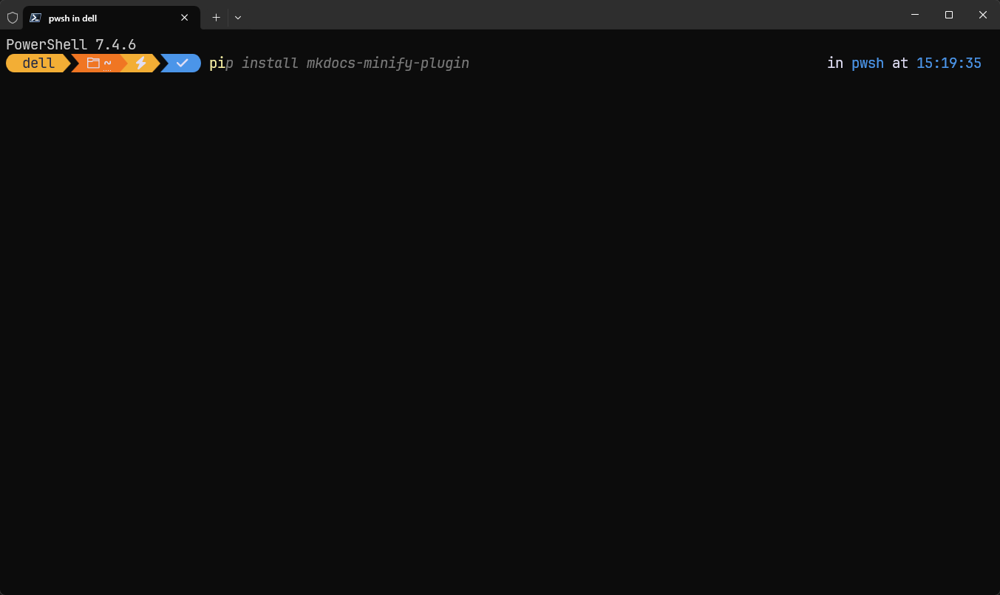
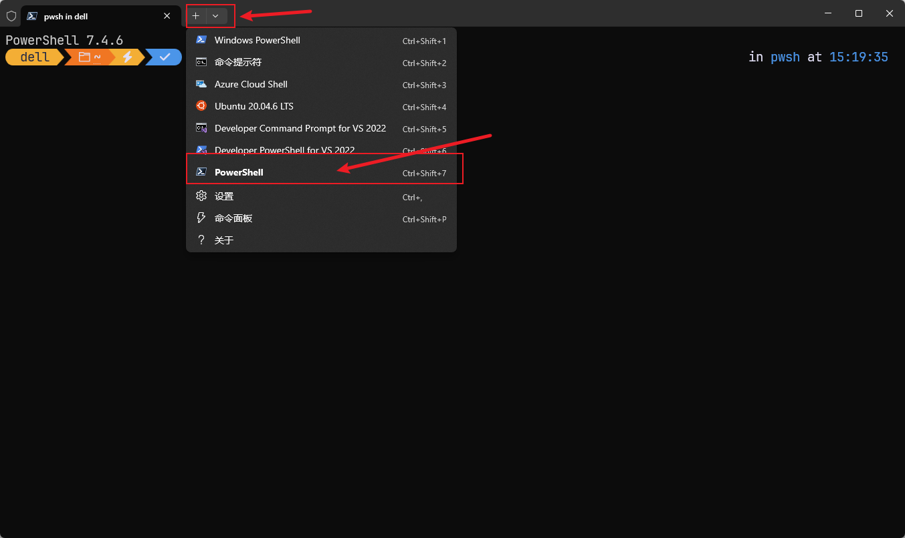
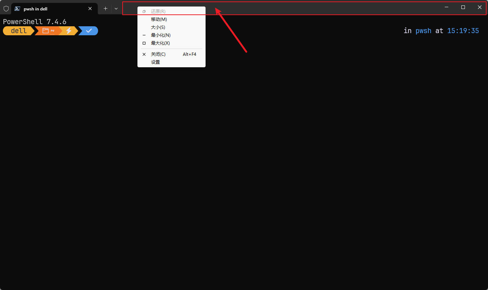
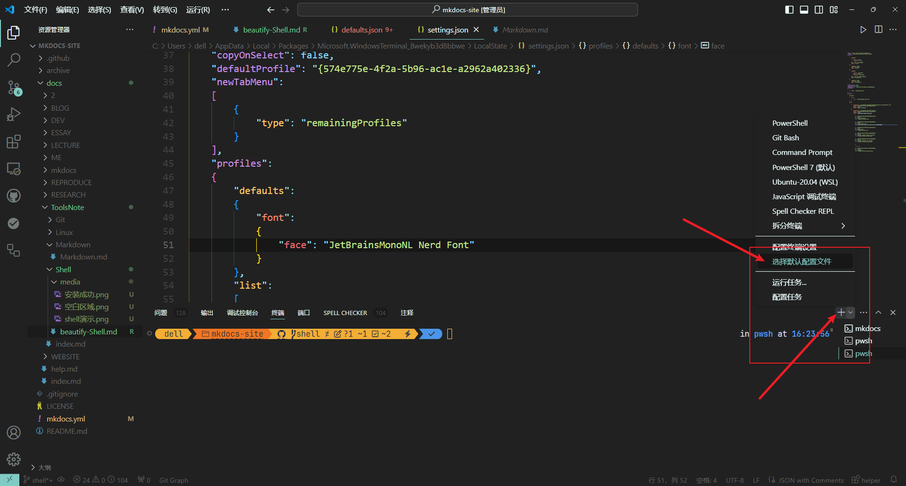

# Shell美化教程

经常看教学视频的小伙伴们应该经常能看到，很多up主的`shell`终端非常的**炫酷**并且有**提示词**，就类型于这种效果，并且这些效果在vscode里面同样有效:  


这里面既有不同的颜色来区分路径，又有提示词来猜测我们接下来可能会输入的命令，因此我们对shell终端进行一些改造来方便我们操作还是很有必要的。

## 安装Shell

首先我们需要一个Shell，我们打开浏览器搜索[PowerShell core]([在 Windows 上安装 PowerShell - PowerShell | Microsoft Learn](https://learn.microsoft.com/zh-cn/powershell/scripting/install/installing-powershell-on-windows?view=powershell-7.4))，其中找到微软的相关页面，可以看到在不同的操作系统上都有相关的安装方法，这里我们选择在Windows上使用winget去安装我们的PowerShell：

​	点击`win+r`之后打开运行，然后输入`cmd`进入终端，输入如下指令：

```powershell
winget install --id Microsoft.PowerShell --source winget
```

等待过程结束就完成了PowerShell的安装。

## 切换到PoweShell

在安装完成之后如何查看是否安装成功呢？我们重新打开一个新的终端，然后点击上方的`+`号，如果出现了这个终端就说明我们已经安装成功了。


如果按照成功，接下来我们鼠标右键点击`+`号旁边的空白区域，找到设置选项，然后打开设置：



## 设置配置

找到设置里面我们对应的PowerShell终端，然后下滑找到其他设置-外观，进入外观之后我们就可以对PowerShell里面的字体大小以及字体样式进行操作了，这里如果想看看自己的电脑支持哪些字体，可以在搜索框里面搜索**字体设置**，里面的字体就是我们可以使用的字体，如果还想拥有更多字体的话，可以点击[字体]([Nerd Fonts - Iconic font aggregator, glyphs/icons collection, & fonts patcher](https://www.nerdfonts.com/font-downloads)),前往下载自己想要的字体，解压缩之后全部添加进字体里即可。

## 安装插件

### posh-git

接下来我们开始让我们的终端炫酷起来，我们首先安装`posh-git`：

```powershell
Install-Module posh-git
```

然后选择的地方输入y即可。

!!! note
    如果出现报错信息，应该是网络或者配置问题，可以试着通过提示信息解决。

### oh-my-posh

#### 本体安装

接下来我们安装`oh-my-posh`模块，我们还是使用之前的winget来安装：

```powershell
winget install JanDeDobbeleer.OhMyPosh -s winget
```

这里打包了两个东西：

`oh-my-posh.exe`-可执行文件

`themes`-Oh My Posh的最新主题

然后我们需要将路径添加到我们的环境变量里面：

``````powershell
$env:Path += ";C:\Users\user\AppData\Local\Programs\oh-my-posh\bin"
``````

这个指令可能会失效，因此我们可以打开环境变量看看是否添加成功，如果没有我们就手动添加:

```
C:\Users\user\AppData\Local\Programs\oh-my-posh\bin
```

添加完成之后，为了防止防火墙一直扫描，我们可以在终端里输入这条指令来避免反复扫描：

```powershell
(Get-Command oh-my-posh).Source
```

#### 字体安装

我们可以使用终端来安装oh-my-posh的字体：

```powershell
oh-my-posh font install
```

输入完之后会出现很多可以选择的字体，这里我们选择自己想要的字体，当然也可以通过指令来安装

，比如安装`meslo`:

```
oh-my-posh font install meslo
```

之后输入指令：

````
("AtlasEngine")
````

使用最新的文本渲染器防止渲染失效。

##### Windows Terminal

在安装完刚刚的字体之后，我们需要在不同的地方进行单独的配置，在终端中使用快捷键 `CTRL + SHIFT + ,`，打开settings.json，然后找到profiles里面的defaults属性，把font.face属性配置为刚刚的字体。

```json
{
    "profiles":
    {
        "defaults":
        {
            "font":
            {
                "face": "MesloLGM Nerd Font"
            }
        }
    }
}
```

##### Visual Studio Code

打开vscode，然后选择`选择默认配置文件`，查看是否有我们刚刚配置好的终端，如果没有说明环境变量没有生效，或者需要重启电脑才能生效。


切换完之后我们使用快捷键`CTRL + ,`

然后在搜索框里面搜索`Integrated: Font Family`，接下来我们找到这个属性：`terminal.integrated.fontFamily`,将属性值改成我们的字体

```
"terminal.integrated.fontFamily": "MesloLGM Nerd Font"
```

#### 启动项配置

接下来我们打开刚刚的PowerShell，输入：

```powershell
notepad $PROFILE
```

如果说找不到文件，那么输入：

```powershell
New-Item -Path $PROFILE -Type File -Force
```

之后重新输入notepad那条指令就可以了。

输入成功之后我们打开了一个空白的文本，我们将这条shell指令复制进去保存：

```powershell
oh-my-posh init pwsh | Invoke-Expression
```

然后我们在终端里面输入：

```powershell
& ([ScriptBlock]::Create((oh-my-posh init pwsh --config "$env:POSH_THEMES_PATH\jandedobbeleer.omp.json" --print) -join "`n"))
```

接着输入：

```powershell
. $PROFILE
```

## 完成

以上步骤都完成之后，你就拥有了一个独属于你的Shell终端了，接下来快去使用试试看吧！

如果有问题的话可以在[主页](https://yangdax1an.github.io/mydocs/)里面联系我和我反馈哦:smile_cat:

