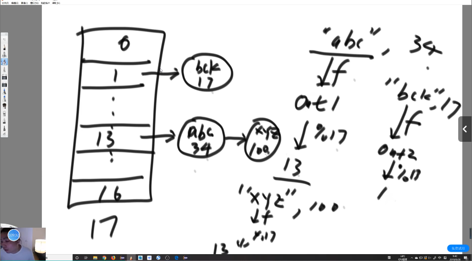

# 哈希

## 认识哈希函数和哈希表的实现

### 什么是哈希函数

#### 第一个特点：范围

$out F (in)$是一个函数，其中in是输入，F是哈希函数，out是输出。

1. $in：$输入域是无穷的
2. $out：$输出域是有限的

典型的哈希函数：`MD5算法`和`SHA1算法`

MD5：输出范围为0 ~2^64  -1

SHA1：输出范围为0 ~2^128  -1

比如我们常见的链接码，就是一个16进制的哈希值：1159798e67f9a6d001d16508ef7a5643

而这个值的大小就是在哈希函数的输出范围内，因此哈希函数的输出是有限的

因此MD5会返回一个长度为16的字符串，而SHA1会返回一个长度32的字符串。

#### 第二个特点：same in -> same out

相同的输入进入哈希函数会得到相同的输出，意味着哈希函数**没有任何随机**的成分

#### 第三个特点：diff in -> same out（哈希碰撞）

虽然会有碰撞的可能性，但是概率非常非常小，比如你从**出生的那一刻开始**，每秒钟随机生成10个字符串，利用`MD5算法`进行哈希值计算，到**你死亡的那一刻结束**，产生过至少一次碰撞的概率，和被多次雷劈中还活下来的概率差不多。因此选择合适的哈希函数可以有效规避哈希碰撞的可能性。

#### 第四个特点：离散性和均匀性

1. **离散性**：相同的两个字符串，其中一个随机改变一个字母，产生出来的两个值差别十分大。
2. **均匀性**：在一个大量哈希值生成的范围内，用相同的尺度去截取其中的内容，尺度中得到的节点数量差不多。不会出现集中分布的情况。


一个哈希函数的离散性越好越优秀。

### 使用哈希函数

1. 所有的`输入in`通过相同的`哈希函数f`得到**均匀**的`输出S`
2. **均匀**的输出S通过**模运算**$\%m$得到**最终输出**O，O的范围是$[0,m-1]$

因为S是均匀分布的，因此O也是均匀分布的。因为O的范围太大了，我们可以通过m的值来得到我们先要范围内的哈希值。


### 题目：1G内存找40亿数中出现次数最多的数


有一个巨大的文件，里面存储了**40亿个**无符号整数，其中一个数的数据范围是[0,2^32-1]，限制只有**一个G**内存，找出其中出现次数最多的数，该如何做？

* 如果我们忽略内存限制，则可以使用哈希表进行计算：

HashMap	key（int） value（出现次数）

因为一条记录至少为4B+4B=**8Byte**，因此40亿条记录至少需要320亿Byte=**32G**内存

* 将这40亿个数通过哈希函数分类，离散到100个文件里面去，再对这100个小文件使用哈希表计算出现最多的数，再把这100个筛选出来的数再筛选，得到最后的答案

  

因为相同的数一定会进入相同的文件，并且分成100份小文件之后，小文件之间也可以保证均分

###  什么是哈希表

哈希表是基于哈希函数实现的，假设我们有一个数组，下标从0~17，当有一个输入想要进入哈希表时，例如**“abc”，34**，其中“abc”是key，34是value，因此将“abc”当作输入传入哈希函数，得到哈希值**I**，**I**的范围取决于哈希函数，因此不一定落在0~17内，此时我们需要对**I**进行**模运算**，此处就`mod17`，最后的答案就是我们放入数组的位置。

因为会发生碰撞，所以数组的同一个位置可能存放多个值，因此我们使用**链表**来组织同一个位置的值。

因为哈希函数的**均匀特性**，不同位置的链表长度相对一致，均匀变长。



因为数组长度有限，当加入的数据过多时，哈希表就会退化成链表，因此当链表长度过长时，需要有合适的**扩容机制**。

**扩容机制：**当数组中某一个链表的长度超过一个阈值之后，因为**均匀性**，我们可以认为整个哈希表的链表都快到达阈值，因此可以选择将数组的长度扩充一倍，然后**重新计算哈希值**放入到新数组中。

位置确定：哈希函数+模运算（$O(1)$）

查找：遍历单向链表($O(1)$)

扩容：数组整体翻倍（扩容次数$O(log^N)$次、代价$O(N)$）总代价：$O(N*log^N)$

JVM中可以使用**离线扩容技术**来加速哈希表的使用，在实际运行时加速。

```java
public class Code01_HashMap {

	public static void main(String[] args) {
		HashMap<String, String> map = new HashMap<>();
		map.put("zuo", "31");

		System.out.println(map.containsKey("zuo"));
		System.out.println(map.containsKey("chengyun"));
		System.out.println("=========================");

		System.out.println(map.get("zuo"));
		System.out.println(map.get("chengyun"));
		System.out.println("=========================");

		System.out.println(map.isEmpty());
		System.out.println(map.size());
		System.out.println("=========================");

		System.out.println(map.remove("zuo"));
		System.out.println(map.containsKey("zuo"));
		System.out.println(map.get("zuo"));
		System.out.println(map.isEmpty());
		System.out.println(map.size());
		System.out.println("=========================");

		map.put("zuo", "31");
		System.out.println(map.get("zuo"));
		map.put("zuo", "32");
		System.out.println(map.get("zuo"));
		System.out.println("=========================");

		map.put("zuo", "31");
		map.put("cheng", "32");
		map.put("yun", "33");

		for (String key : map.keySet()) {
			System.out.println(key);
		}
		System.out.println("=========================");

		for (String values : map.values()) {
			System.out.println(values);
		}
		System.out.println("=========================");

		map.clear();
		map.put("A", "1");
		map.put("B", "2");
		map.put("C", "3");
		map.put("D", "1");
		map.put("E", "2");
		map.put("F", "3");
		map.put("G", "1");
		map.put("H", "2");
		map.put("I", "3");
		for (Entry<String, String> entry : map.entrySet()) {
			String key = entry.getKey();
			String value = entry.getValue();
			System.out.println(key + "," + value);
		}
		System.out.println("=========================");

		// you can not remove item in map when you use the iterator of map
//		 for(Entry<String,String> entry : map.entrySet()){
//			 if(!entry.getValue().equals("1")){
//				 map.remove(entry.getKey());
//			 }
//		 }

		// if you want to remove items, collect them first, then remove them by
		// this way.
		List<String> removeKeys = new ArrayList<String>();
		for (Entry<String, String> entry : map.entrySet()) {
			if (!entry.getValue().equals("1")) {
				removeKeys.add(entry.getKey());
			}
		}
		for (String removeKey : removeKeys) {
			map.remove(removeKey);
		}
		for (Entry<String, String> entry : map.entrySet()) {
			String key = entry.getKey();
			String value = entry.getValue();
			System.out.println(key + "," + value);
		}
		System.out.println("=========================");

	}

}
```


## 设计RandomPool结构

### 题目和要求

题目：设计一种结构，在该结构中有如下三个功能：

* **insert(key):**将某个key加入到该结构，做到不重复加入。

* **delete(key)：**将原本在结构中的某个key移除。

* **getRandom():**等概率随机返回结构中的任何一个key。

要求：Insert、delete和getRandom方法的时间复杂度都是$O(1)$。

### 解法

定义两张哈希表Map1和Map2，其中Map1用于存放**key->index**，而Map2用于存放**index->key**，而这两个表是反转的关系。

在添加**key**的时候，我们将对应的**index**设置成现在哈希表**size的大小**，然后同步更新Map1和Map2。

在删除**key_a**的时候，通过**size**和Map2找到**最后一个key_b以及index_b**，在Map1进行更新，将**key_b**的**index_b**改为**key_a**的**index_a**，删除**key_a和index_a**，在Map2进行更新，将**index_a**的**key_a**改为**key_b**，删除最后一条记录，**size减一**。

**getRandom**则用随机数生成一个$[0,size-1]$范围内的数，通过Map2找到对应的key返回。

```java
public class Code02_RandomPool {

	public static class Pool<K> {
		private HashMap<K, Integer> keyIndexMap;
		private HashMap<Integer, K> indexKeyMap;
		private int size;

		public Pool() {
			this.keyIndexMap = new HashMap<K, Integer>();
			this.indexKeyMap = new HashMap<Integer, K>();
			this.size = 0;
		}

		public void insert(K key) {
			if (!this.keyIndexMap.containsKey(key)) {
				this.keyIndexMap.put(key, this.size);
				this.indexKeyMap.put(this.size++, key);
			}
		}

		public void delete(K key) {
			if (this.keyIndexMap.containsKey(key)) {
				int deleteIndex = this.keyIndexMap.get(key);
				int lastIndex = --this.size;
				K lastKey = this.indexKeyMap.get(lastIndex);
				this.keyIndexMap.put(lastKey, deleteIndex);
				this.indexKeyMap.put(deleteIndex, lastKey);
				this.keyIndexMap.remove(key);
				this.indexKeyMap.remove(lastIndex);
			}
		}

		public K getRandom() {
			if (this.size == 0) {
				return null;
			}
			int randomIndex = (int) (Math.random() * this.size); // 0 ~ size -1
			return this.indexKeyMap.get(randomIndex);
		}

	}
}
```

## 详解布隆过滤器

用于**黑名单系统**或者**爬虫去重问题**

两个限制：

* 添加之后**不能删除**
* **允许出错，失误无法避免**

假设有100亿个URL组成的大文件，是**黑名单**，这些URL都是不允许访问的URL，假设每个URL是64Byte，因此如果我们使用HashSet去存储这些黑名单，一共就需要640亿Byte，差不多**640G**。对于服务器来说需要消耗大量的资源，而且每次访问URL都要访问服务器代价太大，因此我们希望使用用户内存来存储黑名单。

假设你想使用爬虫去爬取网络上的资源，如果使用单线程速度太慢不现实，因此我们使用**多线程**去处理，但是多线程之间可能会访问同一个URL，因此可以使用**布隆过滤器**去保证爬虫去重。

出错情况：

- 黑 -> 白 [x]

- 白 -> 黑 [√]

不会放过错误的，但是会误报正确的

通过人为设计，可以控制失误率，比如说万分之一

### 实现结构

位图Bit Map

例如**int[]**，每个int里面存储一个数，占用4Byte，32bit。

**long[]**，每个long里面存储一个数，占用8Byte，64bit。

**bit[]**，每个bit里面**只存储0/1，占用1bit**。

```java
package 基础提升.class01;

/**
 * 位图类，用于存储和查询整数。
 * 位图是一种高效的数据结构，适用于存储大量不重复的整数。
 * 好的，以下是 `Code05_BitMap` 类的原理详细解释：
 *
 * ### 位图（Bitmap）原理
 *
 * 位图是一种高效的数据结构，用于存储和查询大量的不重复整数。其核心思想是使用一个位数组来表示数据的存在状态。每个位可以表示一个布尔值（0 或 1），其中 1 表示某个整数存在，0 表示不存在。
 *
 * ### 具体实现
 *
 * 1. **位数组**：
 *    - `private long[] bits;`：这是一个长整型数组，用于存储位图数据。每个 `long` 类型的变量有 64 位，因此每个 `long` 可以表示 64 个整数的状态。
 *
 * 2. **构造方法**：
 *    - `public BitMap(int max)`：构造一个新的位图实例。参数 `max` 表示位图的最大值，用于确定数组的大小。
 *    - 计算公式 `(max + 63) >> 6` 用于确定数组的长度。这里 `>> 6` 相当于除以 64 并向上取整，确保数组能够容纳 `max` 个整数。
 *
 * 3. **添加整数**：
 *    - `public void add(int num)`：向位图中添加一个整数。
 *    - `bits[num >> 6] |= (1L << (num & 63))`：
 *      - `num >> 6`：计算 `num` 在数组中的索引位置。`>> 6` 相当于除以 64。
 *      - `num & 63`：计算 `num` 在该 `long` 中的具体位位置。`& 63` 相当于取模 64。
 *      - `1L << (num & 63)`：将 1 左移 `num & 63` 位，生成一个只有该位为 1 的 `long` 值。
 *      - `|=`：将该位设置为 1，表示 `num` 存在。
 *
 * 4. **删除整数**：
 *    - `public void delete(int num)`：从位图中删除一个整数。
 *    - `bits[num >> 6] &= ~(1L << (num & 63))`：
 *      - `~(1L << (num & 63))`：生成一个只有该位为 0 的 `long` 值。
 *      - `&=`：将该位设置为 0，表示 `num` 不存在。
 *
 * 5. **检查整数**：
 *    - `public boolean contains(int num)`：检查位图中是否包含某个整数。
 *    - `(bits[num >> 6] & (1L << (num & 63))) != 0`：
 *      - `bits[num >> 6] & (1L << (num & 63))`：检查该位是否为 1。
 *      - `!= 0`：如果结果不为 0，表示 `num` 存在。
 *
 * ### 位运算解释
 *
 * - **右移运算符 `>>`**：将二进制数向右移动指定的位数，高位补 0。
 * - **按位与运算符 `&`**：对两个二进制数进行逐位与操作，相同位都为 1 时结果为 1，否则为 0。
 * - **按位或运算符 `|`**：对两个二进制数进行逐位或操作，相同位有一个为 1 时结果为 1，否则为 0。
 * - **按位取反运算符 `~`**：对二进制数进行逐位取反操作，1 变 0，0 变 1。
 * - **左移运算符 `<<`**：将二进制数向左移动指定的位数，低位补 0。
 *
 * ### 总结
 *
 * 位图通过使用位数组来高效地存储和查询大量的不重复整数。每个 `long` 类型的变量可以表示 64 个整数的状态，通过位运算操作来实现添加、删除和查询功能。这种数据结构在处理大规模数据时具有很高的空间和时间效率。
 *
 * 希望这些解释能帮助你更好地理解 `Code05_BitMap` 类的原理。如果有其他问题或需要进一步的解释，请告诉我。
 */
public class Code05_BitMap {
    /**
     * 位图类的内部实现。
     */
    public static class BitMap {
        /**
         * 存储位图数据的数组。
         */
        private long[] bits;

        /**
         * 构造一个新的位图实例。
         *
         * @param max 位图的最大值，用于确定数组的大小。
         */
        public BitMap(int max) {
            bits = new long[(max + 63) >> 6];
        }

        /**
         * 向位图中添加一个整数。
         *
         * @param num 要添加的整数。
         */
        public void add(int num) {
            bits[num >> 6] |= (1L << (num & 63));
        }

        /**
         * 从位图中删除一个整数。
         *
         * @param num 要删除的整数。
         */
        public void delete(int num) {
            bits[num >> 6] &= ~(1L << (num & 63));
        }

        /**
         * 检查位图中是否包含某个整数。
         *
         * @param num 要检查的整数。
         * @return 如果位图中包含该整数，则返回 true；否则返回 false。
         */
        public boolean contains(int num) {
            return (bits[num >> 6] & (1L << (num & 63))) != 0;
        }
    }
}

```

### 布隆过滤器的实现

**使用多个位图**，对于同一个URL使用多个不同的哈希函数+模运算，得到的结果放到多个位图中，例如有k个哈希函数，那就有k个位图，第一个哈希函数+模运算得到的结果为**out1**，那么**map1[out1]=1**，以此类推将所有的位图都进行更新即插入成功。

**插入:**将插入的URL使用多个哈希函数+模运算处理得到的结果分别放入对应的位图中存储。

**查询：**对查询的URL进行同样的哈希函数+模运算处理，如果每一个位图上的值都为1，那么则视为查询成功，如果有一位不为1则查询失败。

**碰撞：**只有查询的URL得到的k个哈希值+模运算与所有的已添加的URL在这k次运算中都发生至少一次碰撞才会导致出错。

### 计算公式

$n=样本量，P=失误率$


1. 确定集合行为：只有添加没有删除
2. 可以允许失误。

$m=-\frac{n*\ln P}{\left( \ln 2 \right) ^2}$

$k=ln2*\frac{m}{n}\approx 0.7*\frac{m}{n}$

$P_{\text{真}}=\left( 1-e^{-\frac{n*k_{\text{真}}}{m_{\text{真}}}} \right) ^{k_{\text{真}}}$

其中m为数组的大小/模长，k为哈希函数数量。

## 详解一致性哈希原理

### 简单情况

用于讨论数据服务器如何组织的问题（分布式服务器）

我们一般把整个服务分为逻辑端服务器和数据端服务器。

在逻辑端服务器看实例都是等效的没有区别

但在数据端服务器来看，如果是使用集中式数据库，那么数据也是等效的。

但如果采用的是**分布式数据库**，那么数据在存储的过程中就不等效了，因为不同的数据可能存储到不同的数据库中，而取数据也要找到对应的服务器才能取到数据。


这边数据该归属那个服务器的底层逻辑是通过**哈希+模运算**的方法，把数据分别分配到不同的数据库中，查找的时候再根据key去计算哈希，然后找到对应的服务器去取数据，根据**哈希的均匀性**，可以保证分布式数据库的负载是均衡的。

选择key的时候要选择种类比较多、高频中频低频都有一定的数量的属性作为key，例如姓名等。假如选择性别，那么就只有男或者女，哈希出来的情况只有两种，那么必然有一台服务器是完全空闲的。

### 分布式服务器增加/减少

在逻辑端增加或减少服务器非常简单，并且效率很高，因为逻辑端本身都是一致的。

但如果数据端服务器增加或者减少，那么在**简单情况**的情景下，所有的数据都**必须要重新计算一遍哈希值然后重新分配**，这样扩容的代价就特别的大。增加/减少数据库的代价是全量的。

### 一致性哈希

一致性哈希不存在模运算，假设我们采用MD5算法作为哈希函数，那么得到的结果的范围为$[0,2^{64}-1]$，把哈希值的域想象成为一个**环**，那么在0位置上右边就是1，左边就是$2^{64}-1$。


现在假设有三台服务器用来存储数据，我们可以根据这三台服务器的物理地址将其进行哈希计算得到对应的值，然后插入到环上。


#### 确定数据的归属

三台数据端服务器得到的结果有一个排序数组，将排序数组存在所有的逻辑端服务器里，假如有数据要确定归属，那么就计算出这个数据的哈希值，然后在排序数组中做二分查找，找到比当前哈希值大的最小数，然后对应的数据库就是这个数据的归属。

#### 添加或减少机器

如果添加一个机器，就把对应的属于这个机器的数据计算哈希值放入新的机器里，如果减少一个机器，就把这个机器里面所有的值重新计算哈希放到其他的机器里面，对应的排序数组进行更新即可。

#### 问题

* 无法确保均分
* 无法进行负载均衡

### 虚拟节点技术

给所有的机器随机分配大量的字符串，例如一共有三台机器，那我们就给每个机器分配1000个字符串，然后对这1000个字符串进行哈希值计算然后排序，这样就有**3000个虚拟节点**，用这3000个虚拟节点去抢环，**因此只要分配的节点数多就可以保证均分**，而且通过**分配的字符串数量**也可以**控制负载均衡**，比如当前服务器性能好，我们就可以多分配一点字符串，当前服务器性能差，我们就少分配一点字符串。

虚拟节点的数据迁移也比较简单，比如将M1机器上a1000节点的数据重新分配到M2机器的b500节点，那么只要找到M1机器中属于a1000节点的数据之间加入到M2即可。